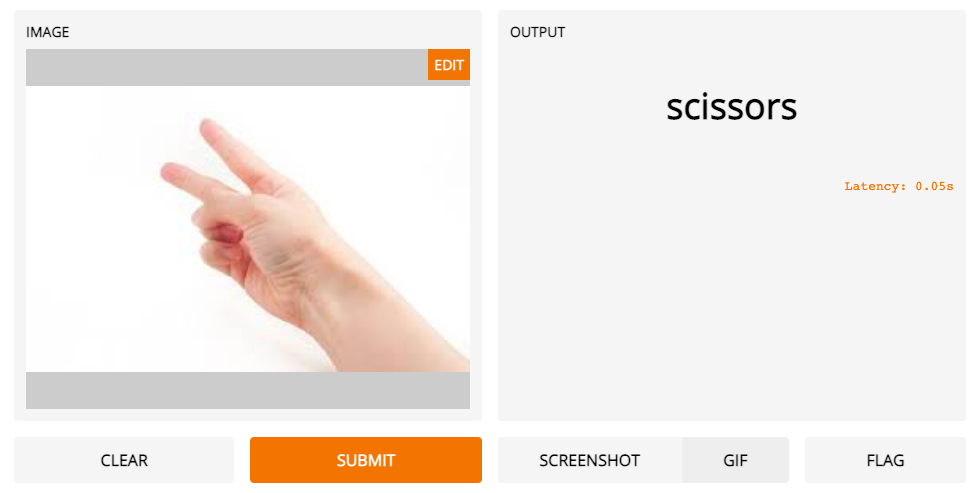

# Gradio
 
 
 **1. Rock_paper_scissors_gr.ipynb :**  
 - Dataset: Rock paper scissors [(Tensorflow)](https://www.tensorflow.org/datasets/catalog/rock_paper_scissors)
 - CNN architecture: Pre-trained VGG16 [(Keras applications)](https://keras.io/api/applications/vgg/#vgg16-function)
 - GUI: [Gradio](https://www.gradio.app/)

**2. rock_paper_scissors_g5.h5 :**
 - VGG16 Model trained on Rock paper scissors Dataset

